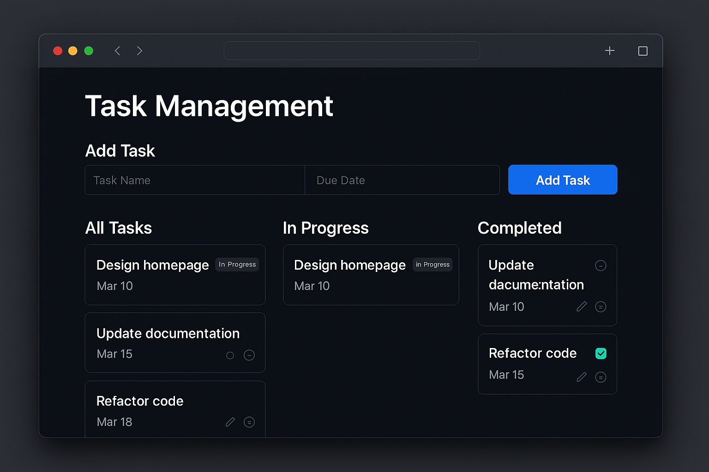
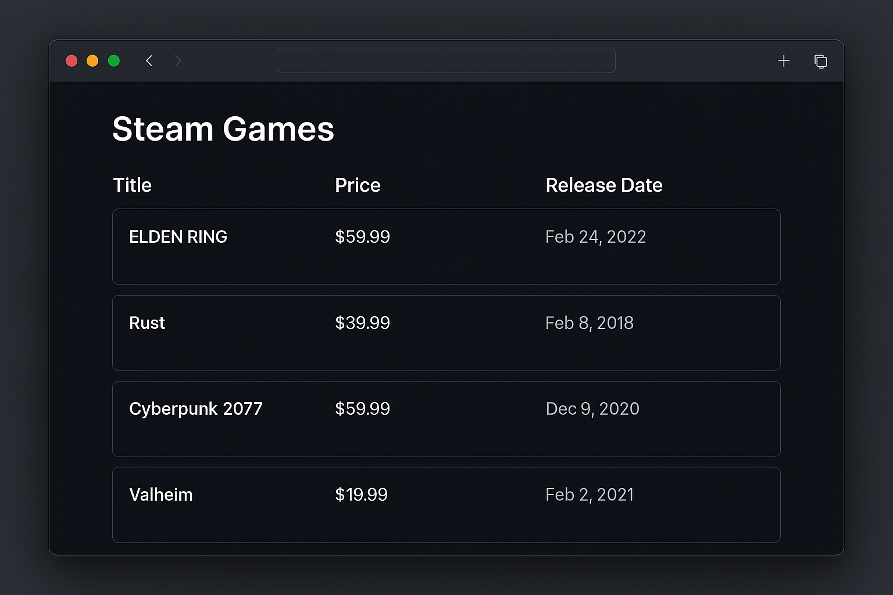
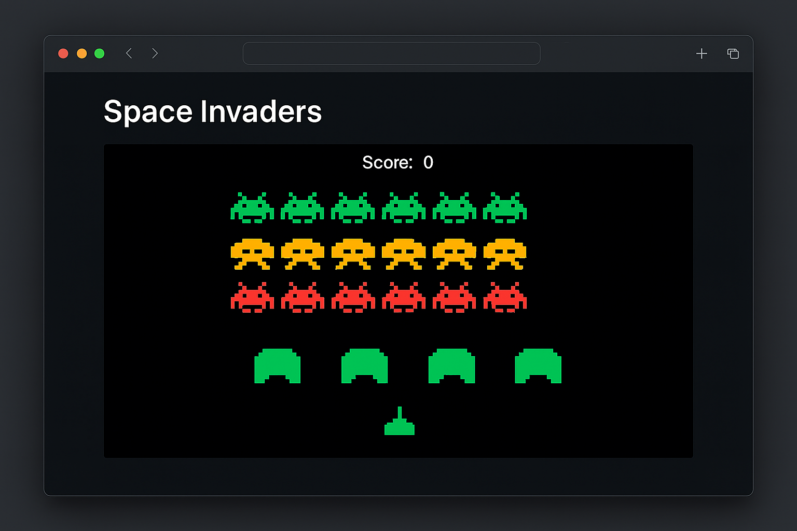
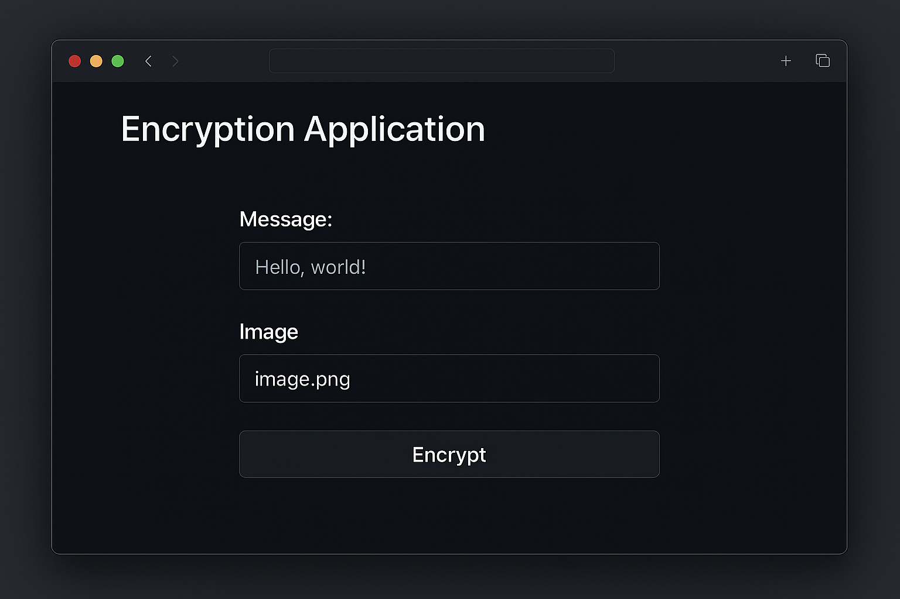
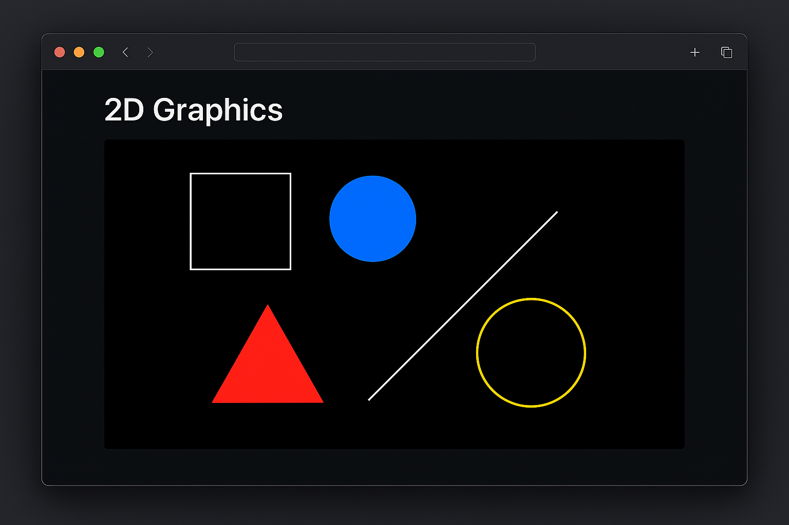
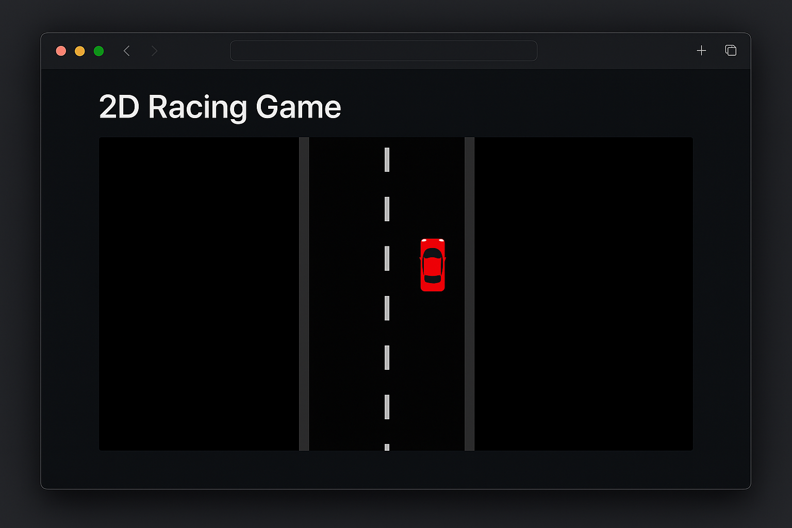
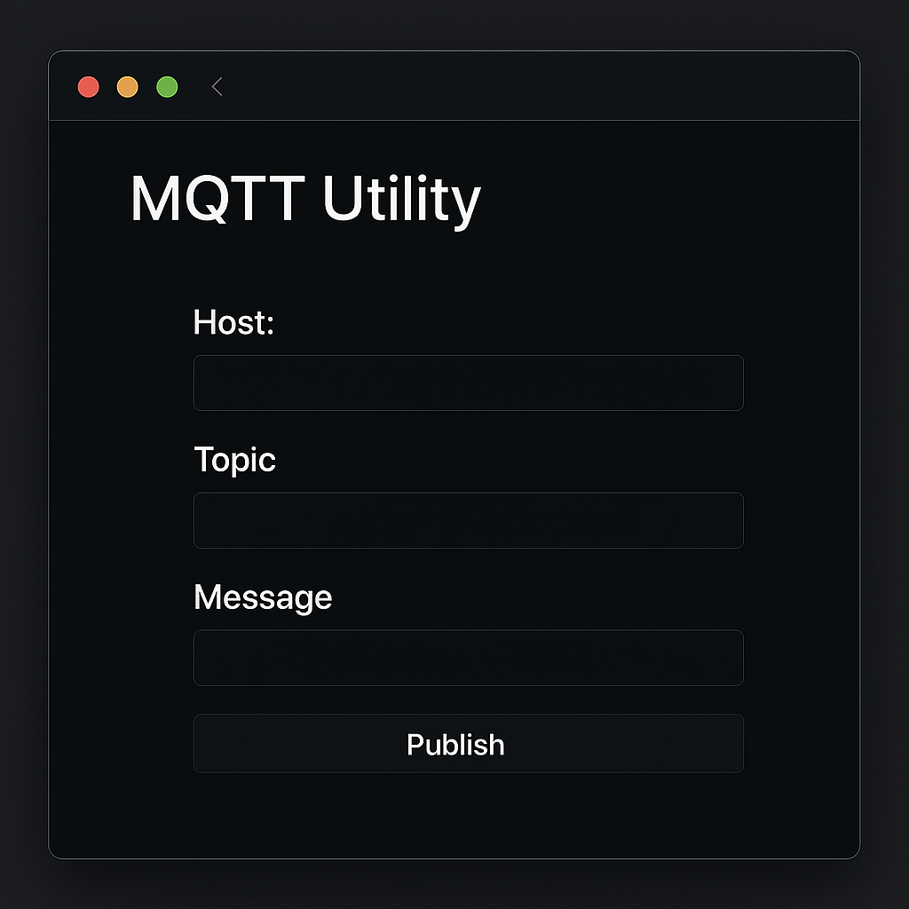

# 📚 My Programming Portfolio 🌐

  

---

## About Me

I am a dedicated software developer with a passion for solving complex problems using Python, C++, and Go. My expertise lies in building efficient, scalable, and innovative solutions that leverage the unique strengths of these languages. I thrive on system-level programming, game development, and security-focused applications.

---

## 🛠️ Skills

### 🐍 Python

- **Web Development:** Django, Flask
- **Web Scraping:** Selenium, BeautifulSoup4
- **Desktop Apps:** PySide6
- **Game Development:** Pygame
- **Steganography Projects**

### 💻 C++

- **System Programming:** Windows API, DirectX
- **Game Development:** SDL, SFML
- **Desktop Apps:** Qt, GTK, Windows API
- **Performance Optimization**

### 🚀 Go

- **IoT & Sensor Integration**
- **Networking & Data Transmission**
- **Efficient Concurrency Handling**

---

## 📂 Projects

### Python Projects

- 🚀 **Task Management Web App**  
  A Flask-powered web application to manage tasks and deadlines efficiently.
  

    
  

- 🔍 **Steam Game Scraper**  
  A web scraper using Selenium & BeautifulSoup4 to collect and analyze Steam game data.
  

    
  

- 🎮 **Space Invaders Clone**  
  A 2D arcade recreation built with Pygame, emulating the classic Space Invaders gameplay.
  

    
  

- 🔏 **Encryption Desktop Application**  
  A secure desktop tool for encrypting messages via steganography techniques.
  

    
  

### C++ Projects

- 🖼 **Windows Widgets Library**  
  A lightweight 2D graphics library built on the Windows API.
  

    
  

- 🏎 **Racing Game**  
  A fast-paced 2D racing game developed with SFML.
  

    
  

- 📂 **Metadata Corrector**  
  A utility for editing and correcting file timestamps with ease.
  

    
  

### Go Projects

- 🌡 **Proxmox Temperature Sensors → MQTT**  
  A service that publishes Proxmox host temperature data to MQTT brokers for HomeAssistant integration.
  

    
  

---

## 📫 Get In Touch

- 📱 **Phone**: [+66 97 163 7171](tel:+66971637171)
- ✉️ **Email**: [mark.vizzhachiy@gmail.com](mailto:mark.vizzhachiy@gmail.com)
- 🐙 **GitHub**: [Markf349g](https://github.com/Markf349g)
- 🦊 **GitLab**: [mark.vizzhachiy](https://gitlab.com/mark.vizzhachiy)
- 🐘 **Gitee**: [Markf349g](https://gitee.com/Markf349g)
- 👤 **Gravatar**: [markvizzhachiy](https://gravatar.com/markvizzhachiy)
- 🌐 **LinkedIn**: [Mark Vizzhachiy](https://www.linkedin.com/in/mark-v-28033536b)
- 📺 **YouTube**: [@Markf349g](https://www.youtube.com/@Markf349g)
- ❓ **Stack Overflow**: [Markf349g](https://stackoverflow.com/users/30783672/markf349g)
- 🧠 **Stack Exchange Meta**: [Markf349g](https://meta.stackexchange.com/users/1774543/markf349g)
- ✖️ **X (Twitter)**: [@markf349g](https://x.com/markf349g)
- 🐘 **Mastodon**: [@Markf349g@mastodon.social](https://mastodon.social/@Markf349g)
- 💼 **Upwork**: [Markf349g](https://www.upwork.com/freelancers/~01721832aea465bde6?mp_source=share)
- 🧑‍💻 **Freelancer**: [Markf349g](https://www.freelancer.com/u/Markf349g?frm=Markf349g&sb=t)
- 🛠️ **LaborX**: [Markf349g](https://laborx.com/customers/users/id388396?ref=388396)
- 🆔 **ORCID**: [0009-0005-4166-3841](https://orcid.org/0009-0005-4166-3841)
- 💬 **Discord**: `1038754229541670933`
